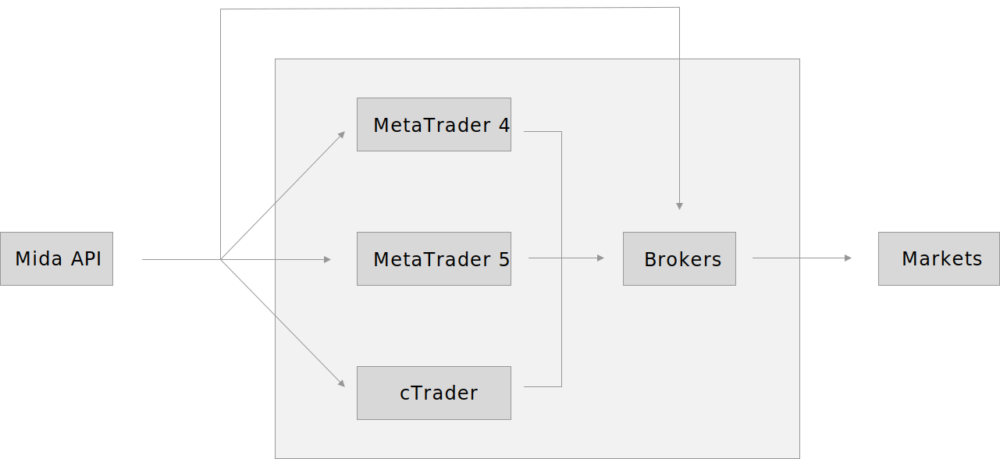

<br>
<p align="center"> 
    
</p>
<br>

A JavaScript framework to easily operate in financial markets.

Mida is designed to:
- Trade financial assets such as stocks, crypto, forex or commodities;
- Operate with any MetaTrader broker account using only JavaScript/TypeScript;
- Automate and backtest trading strategies through expert advisors and indicators;
- Analyze markets and prices through indicators and analysis interfaces.

Furthermore, Mida is free and open source, join the [Discord community](https://discord.gg/cKyWTUsr3q).

<br>
<p align="center"> 
    
</p>
<br>

**This is a work in progress project, the API is not fully implemented, the NPM module is not published.<br>
At this time only the Playground broker is fully supported. Please create an issue for questions.**

## Installation
The easiest way to install Mida is using the following command in your project directory.
```console
npm install @reiryoku/mida
```

## Usage
This project is incomplete! Parts of the API may not be implemented or have different configurations.
For contributions please create an issue.
The objective is creating a common API allowing to operate in financial markets with MetaTrader, cTrader and the other independent brokers APIs.

### Broker account login
How to login into a MetaTrader 4 broker.
```javascript
const { MidaBroker } = require("@reiryoku/mida/brokers/MidaBroker");

const myAccount = await MidaBroker.login("MT4", {
    id: "foo",
    password: "bar",
    serverName: "FooBar",
});
```

How to login into an independent broker.
```javascript
const { MidaBroker } = require("@reiryoku/mida/brokers/MidaBroker");

const myAccount = await MidaBroker.login("ICMarkets", {
    email: "foo@bar.com",
    id: "foo",
    password: "bar",
});
```

#### Playground
Playground is a local broker created by Mida for paper trading.
```javascript
const { MidaBroker } = require("@reiryoku/mida/brokers/MidaBroker");

const myAccount = await MidaBroker.login("Playground", {
    id: "test",
    localDate: new Date("2020-04-23T00:00:00"),
    currency: "USD",
    balance: 10000,
    negativeBalanceProtection: true,
});

// Used to listen any market ticks.
myAccount.on("tick", (event) => {
    const tick = event.descriptor.tick;
    
    console.log(`New tick for ${tick.symbol} => ${tick.bid} | ${tick.ask}`);
});

// Used to elapse a given amount of time in the local date, this will trigger ticks.
await myAccount.elapseTime(60 * 10); // 60 seconds * 10 = 10 minutes.

console.log(myAccount.localDate); // The local date is now 2020-04-23 00:10:00.
```

### Broker orders and positions
How top open a long position for Bitcoin against USD.
```javascript
const { MidaBrokerOrderType } = require("@reiryoku/mida/orders/MidaBrokerOrderType");

const myOrder = await myAccount.placeOrder({
    symbol: "BTCUSD",
    type: MidaBrokerOrderType.BUY,
    lots: 1,
});

console.log(myOrder.ticket);
console.log(myOrder.openPrice);
```

How to open a short position for EUR against USD.
```javascript
const { MidaBrokerOrderType } = require("@reiryoku/mida/orders/MidaBrokerOrderType");

const myOrder = await myAccount.placeOrder({
    symbol: "EURUSD",
    type: MidaBrokerOrderType.SELL,
    lots: 0.1,
});

console.log(myOrder.ticket);
console.log(myOrder.openPrice);
```

<details><summary>More examples</summary>

How to open a long position for GBP against USD with stop loss and take profit.
```javascript
const { MidaBrokerOrderType } = require("@reiryoku/mida/orders/MidaBrokerOrderType");

const symbol = "GBPUSD";
const lastTick = await myAccount.getSymbolLastTick(symbol);
const myOrder = await myAccount.placeOrder({
    symbol,
    type: MidaBrokerOrderType.BUY,
    lots: 0.1,
    stopLoss: lastTick.bid - 0.0010, // Stop loss of 10 pips.
    takeProfit: lastTick.bid + 0.0030, // Take profit of 30 pips.
});
```

</details>

### Symbols
How to retrieve a symbol.
```javascript
const symbol = await myAccount.getSymbol("#AAPL");

if (!symbol) {
    console.log("Apple stocks are not available for this account!");
}
else {
    console.log(symbol.digits);
    console.log(symbol.leverage);
}
```

How to get the price of a symbol.
```javascript
const symbol = await myAccount.getSymbol("BTCUSD");
const price = await symbol.getBid();

console.log(`Bitcoin price is ${price} dollars.`);
```

How to listen the ticks of a symbol.
```javascript
const symbol = await myAccount.getSymbol("#GME");

symbol.on("tick", (event) => {
    const tick = event.descriptor.tick;
    
    console.log(`GameStop share price is now ${tick.bid} dollars.`);
});
```

### Market analysis and indicators
Examples of technical market analysis.

#### Candlesticks
How to get the candlesticks of a symbol (in the code candlesticks and bars are generally referred as periods).
```javascript
const { MidaSymbolPeriodTimeframeType } = require("@reiryoku/mida/periods/MidaSymbolPeriodTimeframeType");

const periods = await myAccount.getSymbolPeriods("EURUSD", MidaSymbolPeriodTimeframeType.M30);
const lastPeriod = periods[periods.length - 1];

console.log("Last candlestick start time: " + lastPeriod.startTime);
console.log("Last candlestick OHLC: " + lastPeriod.ohlc);
console.log("Last candlestick close price: " + lastPeriod.close);
```

#### Relative Strength Index
How to calculate the RSI indicator for Bitcoin on H1 chart.
```javascript
const { MidaIndicator } = require("@reiryoku/mida/indicators/MidaIndicator");
const { MidaSymbolPeriodTimeframeType } = require("@reiryoku/mida/periods/MidaSymbolPeriodTimeframeType");

const periods = await myAccount.getSymbolPeriods("BTCUSD", MidaSymbolPeriodTimeframeType.H1);
const relativeStrengthIndex = await MidaIndicator.calculate("RSI", {
    prices: periods.map((period) => period.close),
    length: 14,
});
```

#### Bollinger Bands
How to calculate the Bollinger Bands indicator for Ethereum on M5 chart.
```javascript
const { MidaIndicator } = require("@reiryoku/mida/indicators/MidaIndicator");
const { MidaSymbolPeriodTimeframeType } = require("@reiryoku/mida/periods/MidaSymbolPeriodTimeframeType");

const periods = await myAccount.getSymbolPeriods("ETHUSD", MidaSymbolPeriodTimeframeType.M5);
const bollingerBands = await MidaIndicator.calculate("BollingerBands", {
    prices: periods.map((period) => period.close),
    length: 20,
});
```

## Disclaimer
Operating in CFDs/Forex is highly speculative and carries a high level of risk.
It's possible to lose all your capital. These products may not be suitable for everyone,
you should ensure that you understand the risks involved. Furthermore, Mida is not responsible
for commissions or other taxes applied to your operations, they depend on your broker,
and any technical inconvenience that may lead to money loss, for example a stop loss not being set.

## Why Mida and not MQL
Nowadays MQL is a procedural technology and a barrier between
modern traders and algorithmic trading. The mission of Mida is allowing
anyone to operate in financial markets without advanced programming skills or
specific computer requirements. Furthermore, Mida allows operating with MetaTrader
accounts without installing MetaTrader (which is available only for Windows OS).

## Contributors
The author and maintainer of the project is [Vasile Pește](https://github.com/Vasile-Peste) (vasile.peste@protonmail.ch).

This project is still in alpha, please create an issue for contributions and questions.
